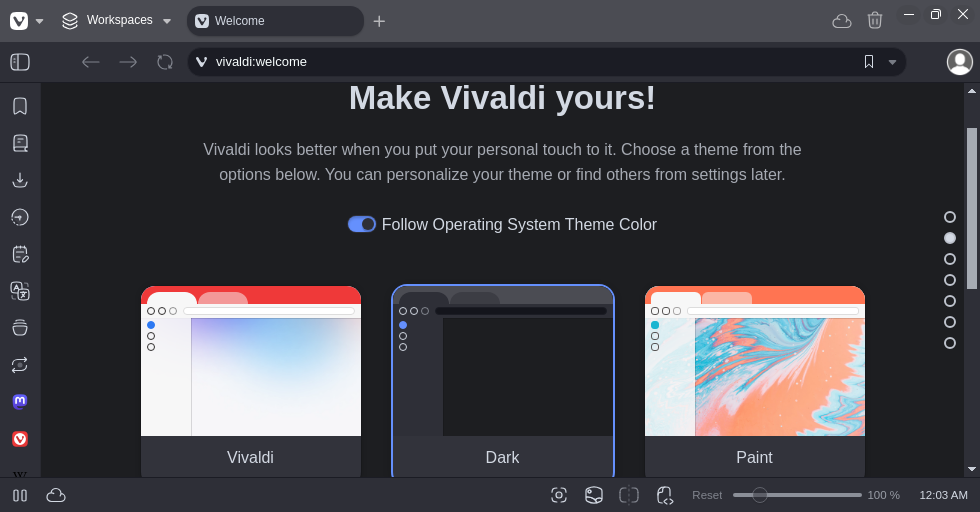
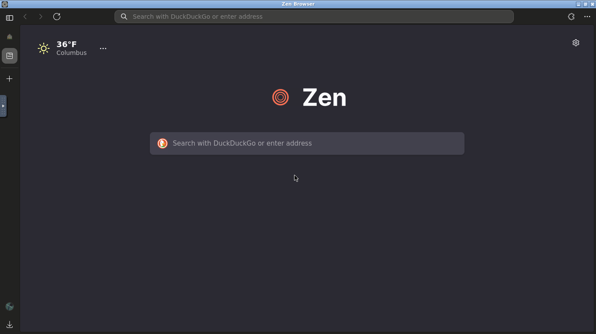
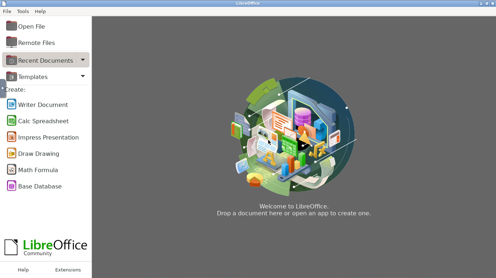
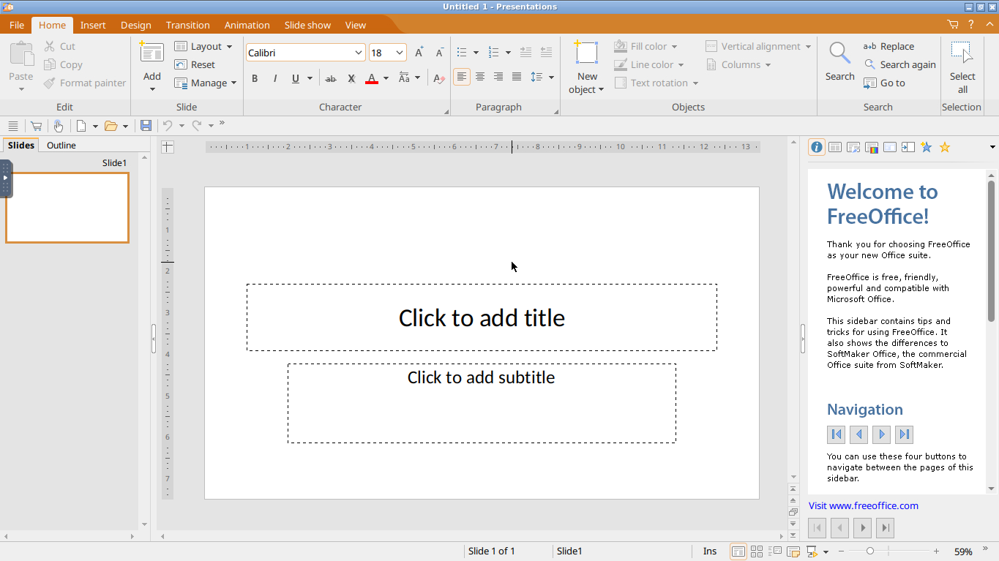
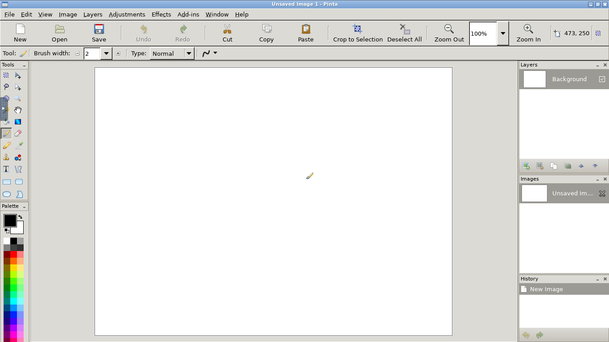

# Browsers-NoVNC
Every browser in a novnc server, plain bash no docker. Does not support audio

***More than just Browsers***
## Table of Contents
>[!IMPORTANT]
> A astrisk(*) next to the anchored link means the contents has not been added yet, or it has the header but doesn't have the contents
>
> 2 astrisks(*) means that the image of what the browser looks like in the NoVNC session has not been added yet
>
> 3 astrisks(*) next to the anchored link means that the browser logo and about the browser has not been added yet
>
> 4 astrisks(*) next to the anchored link means that it neither has the about the browser, browser logo, and image of the what browser looks like in the NoVNC server session
>
> No Asterisks(*) next to the anchored link means it has the about the browser, logo of the browser, and what the browser looks like in NoVNC session

  
<details><summary>Tasks</summary>
  
`Brave does not work but it does work in a linuxserver openbox kasmvnc session`
- [ ] find a way to have a rootless dockerized novnc container then run steam in the dockerized novnc container
- [ ] add link to video pn how to have waterfox noVNC automatically start on boot
- [ ] add all the browsers
- [ ] finish adding all service files 
- [ ] use winehq to install browsers that dont work 
- [ ] use winehq to have opera gx in a browser
- [ ] Contact [@thelamer](https://github.com/thelamer) to see if he he can make a linuxserver kasmvnc docker container for the following browsers
> [!NOTE]
> There are desktop files you can use for the linuxserver kasmvnc docker container for the browsers


`List of browsers to be in a linuxserver in a kasmvnc docker container`

- Brave creates a /usr/share/hicolor/apps/48x48/brave.png
- Tor Browser which is a proot app in the linux server repository "proot apps"
- Google Chrome 
- Falkon
- Waterfox have to create a desktop file for the container and use the tar file
- Zen need to create desktop file 
- Seamonkey 
- Icecat
- Palemoon
- Floorp
- Midori
 
</details>

<details><summary>Google browsers</summary>

- [Chrome NoVNC](#Chrome-NoVNC) ✔️
- [Chromium NoVNC](#Chromium-NoVNC) ✔️

</details>

<details><summary>Chromium Based Browsers</summary>
  
- [Srware Iron NoVNC](#Srware-Iron-NoVNC) ❌ crash after a couple seconds when launched
- [Thorium NoVNC](#Thorium-NoVNC) ✔️
- [Brave NoVNC](#Brave-NoVNC) ✔️
- [Microsft Edge NoVNC](#Microsoft-Edge-NoVNC) ✔️
- [Opera NoVNC](#Opera-NoVNC) ✔️
- [Vivaldi NoVNC](#Vivaldi-NoVNC) ✔️
  
</details>

<details><summary>Mozilla Browsers</summary>
  
- [Firefox NoVNC](#Firefox-NoVNC) ✔️
- [Seamonkey NoVNC](#Seamonkey-NoVNC) ✔️

</details>

<details><summary>Firefox Based Browsers</summary>
  
- [Librewolf-NoVNC](#Librewolf-NoVNC) ✔️
- [Floorp NoVNC](#Floorp-NoVNC) ✔️
- [Tor NoVNC](#Tor-NoVNC) ✔️
- [Mullvad NoVNC](#Mullvad-NoVNC) ✔️
- [Waterfox NoVNC](#Waterfox-NoVNC)
- [Icecat NoVNC](#Icecat-NoVNC) ✔️
- [Zen Novnc](#Zen-NoVNC) ✔️
- [Pale Moon NoVNC](#Pale-Moon-NoVNC) ✔️
- [Midori NoVNC](#Midori-NoVNC) ✔️
- [Pulse NoVNC](#Pulse-NoVNC) ✔️
- [Basilisk NoVNC](#Basilisk-NoVNC) ✔️

</details>

<details><summary>Other</summary>

- [Go To LinuxApps NoVNC](#LinuxApps-NoVNC)

</details>

- [Qutebrowser NoVNC](#Qutebrowser-NoVNC) ✔️
- [Falkon NoVNC](#Falkon-NoVNC) ✔️


# Chrome NoVNC

<br/>
<div align="center">
  <a href="https://google.com/chrome">
    
  </a>

  <h3 align="center">Google Chrome </h3>

  <p align="center">
       Google Chrome is a web browser developed by Google.
    <br/>
</div>

## Run Chrome NoVNC
### Install curl if you don't have it
``` 
sudo apt install curl
```
### Run Chrome NoVNC using Curl
```
curl -fsSL https://raw.githubusercontent.com/GitXpresso/Browsers-NoVNC/refs/heads/main/chromenovnc.sh | bash
```
### Have Chrome automatically starts on boot
### Step 1: Clone the repository
```
git clone https://github.com/gitxpresso/browsers-novnc.git ~/browsers-novnc
```
### Step 2: Go to the cloned directory and edit chrome service "USER" variable on line 13
> [!TIP]
> If you don't know current your linux username then do "whoami" or "echo $USER" to find your current linux username
> 
> You can edit the file using vim after finishing editing the file do `:wq` and press `ENTER` to save and exit
#### Example of what USER variable looks like in the script
The number "13" below is to show what is on line 13
```
13 export USER="linux"
```
### Step 3: After setting the user variable in Step 2 run the command below in your bash terminal
```
sudo mv -f ~/browsers-novnc/chromeservice /etc/init.d/chromenovnc
```
### Step 4: Make the file executable
```
sudo chmod +x /etc/init.d/chromenovnc
```
### create the file in /etc/proflie.d
```
cat << EOF >~/chrome
#!/bin/bash
sudo service chromenovnc start
EOF
```
### move the file to /etc/profile.d
```
sudo mv -f ~/chrome /etc/profile.d
```
### make the file executable
```
sudo chmod +x /etc/profile.d/chrome
```
## What Chrome looks like

# Brave NoVNC

<div align="center">
  <a href="https://brave.com">
    
  </a>
  <h1 align= "center">Brave</h1>
    <br/>
<h3 center "left">Free and open-source web browser developed by Brave Software, Inc. based on the Chromium web browser</h3>
</div>

## Run Brave NoVNC
### Install curl if you don't have it
``` 
sudo apt install curl
```
### Run Brave NoVNC using Curl
```
curl -fsSL https://raw.githubusercontent.com/GitXpresso/Browsers-NoVNC/refs/heads/main/bravenovnc.sh | bash
```
### Have Brave automatically starts on boot
### Step 1: Clone the repository
```
git clone https://github.com/gitxpresso/browsers-novnc.git ~/browsers-novnc
```
### Step 2: Go to the cloned directory and edit brave service "USER" variable on line 13
> [!TIP]
> If you don't know current your linux username then do "whoami" or "echo $USER" to find your current linux username
> 
> You can edit the file using vim after finishing editing the file do `:wq` and press `ENTER` to save and exit
#### Example of what USER variable looks like in the script
The number "13" below is to show what is on line 13
```
13 export USER="linux"
```
### Step 3: After setting the user variable in Step 2 run the command below in your bash terminal
```
sudo mv -f ~/browsers-novnc/braveservice /etc/init.d/bravenovnc
```
### Step 4: Make the file executable
```
sudo chmod +x /etc/init.d/bravenovnc
```
### create the file in /etc/proflie.d
```
cat << EOF >~/brave
#!/bin/bash
sudo service bravenovnc start
EOF
```
### move the file to /etc/profile.d
```
sudo mv -f ~/brave /etc/profile.d
```
### make the file executable
```
sudo chmod +x /etc/profile.d/brave
```
## What Brave looks like

# Chromium NoVNC
<br/>
<div align="center">
  <a href="https://librewolf.net">
    
  </a>
  <h1 align= "center">Chromium </h1>
    <br/>
<h3 center "left">Chromium is a free and open-source web browser project developed primarily by Google, which serves as the foundation for Google Chrome and many other browsers. It is known for its speed, security, and stability, and is widely used in various applications and frameworks.</h3>
</div>

## Run Chromium NoVNC
### Install curl if you don't have it
``` 
sudo apt install curl
```
### Run Chromium NoVNC using Curl
```
curl -fsSL https://raw.githubusercontent.com/GitXpresso/Browsers-NoVNC/refs/heads/main/chromiumnovnc.sh | bash
```
### Have Chromium automatically starts on boot
### Step 1: Clone the repository
```
git clone https://github.com/gitxpresso/browsers-novnc.git ~/browsers-novnc
```
### Step 2: Go to the cloned directory and edit chromium service "USER" variable on line 13
> [!TIP]
> If you don't know current your linux username then do "whoami" or "echo $USER" to find your current linux username
> 
> You can edit the file using vim after finishing editing the file do `:wq` and press `ENTER` to save and exit
#### Example of what USER variable looks like in the script
The number "13" below is to show what is on line 13
```
13 export USER="linux"
```
### Step 3: After setting the user variable in Step 2 run the command below in your bash terminal
```
sudo mv -f ~/browsers-novnc/chromiumservice /etc/init.d/chromiumnovnc
```
### Step 4: Make the file executable
```
sudo chmod +x /etc/init.d/chromiumnovnc
```
### create the file in /etc/proflie.d
```
cat << EOF >~/chromium
#!/bin/bash
sudo service chromiumnovnc start
EOF
```
### move the file to /etc/profile.d
```
sudo mv -f ~/chromium /etc/profile.d
```
### make the file executable
```
sudo chmod +X /etc/profile.d/chromium
```
## What Chromium looks like

# Thorium NoVNC
<br/>
<div align="center">
  <a href="https://thorium.rocks">
    
  </a>
  <h1 align= "center">Thorium </h1>
    <br/>
<h3 center "left">Thorium Browser is a fast, open-source web browser based on Chromium, designed to improve performance and usability. It is available on multiple platforms, including Windows, macOS, Linux, and Android, and aims to provide a more efficient browsing experience compared to standard Chromium.</h3>
</div>

## Run Thorium NoVNC
### Install curl if you don't have it
``` 
sudo apt install curl
```
### Run Thorium NoVNC using Curl
```
curl -fsSL https://raw.githubusercontent.com/GitXpresso/Browsers-NoVNC/refs/heads/main/thoriumnovnc.sh | bash
```
### Have Thorium automatically starts on boot
### Step 1: Clone the repository
```
git clone https://github.com/gitxpresso/browsers-novnc.git ~/browsers-novnc
```
### Step 2: Go to the cloned directory and edit thorium service "USER" variable on line 13
> [!TIP]
> If you don't know current your linux username then do "whoami" or "echo $USER" to find your current linux username
> 
> You can edit the file using vim after finishing editing the file do `:wq` and press `ENTER` to save and exit
#### Example of what USER variable looks like in the script
The number "13" below is to show what is on line 13
```
13 export USER="linux"
```
### Step 3: After setting the user variable in Step 2 run the command below in your bash terminal
```
sudo mv -f ~/browsers-novnc/thoriumservice /etc/init.d/thoriumnovnc
```
### Step 4: Make the file executable
```
sudo chmod +x /etc/init.d/thoriumnovnc
```
### create the file in /etc/proflie.d
```
cat << EOF >~/thorium
#!/bin/bash
sudo service thoriumnovnc start
EOF
```
### move the file to /etc/profile.d
```
sudo mv -f ~/thorium /etc/profile.d
```
### make the file executable
```
sudo chmod +x /etc/profile.d/thorium
```
## What Thorium looks like

# Librewolf NoVNC
<br/>
<div align="center">
  <a href="https://librewolf.net">
    
  </a>
  <h1 align= "center">Librewolf </h1>
    <br/>
<h3 center "left">LibreWolf is a free and open-source fork of Firefox, with an emphasis on privacy and security. </h3>
</div>

## Run Librewolf NoVNC
### Install curl if you don't have it
``` 
sudo apt install curl
```
### Run Librewolf NoVNC using Curl
```
curl -fsSL https://raw.githubusercontent.com/GitXpresso/Browsers-NoVNC/refs/heads/main/librewolfnovnc.sh | bash
```
### Have librewolf automatically starts on boot
### Step 1: Clone the repository
```
git clone https://github.com/gitxpresso/browsers-novnc.git ~/browsers-novnc
```
### Step 2: Go to the cloned directory and edit librewolf service "USER" variable on line 13
> [!TIP]
> If you don't know current your linux username then do "whoami" or "echo $USER" to find your current linux username
> 
> You can edit the file using vim after finishing editing the file do `:wq` and press `ENTER` to save and exit
#### Example of what USER variable looks like in the script
The number "13" below is to show what is on line 13
```
13 export USER="linux"
```
### Step 3: After setting the user variable in Step 2 run the command below in your bash terminal
```
sudo mv -f ~/browsers-novnc/librewolfservice /etc/init.d/librewolfnovnc
```
### Step 4: Make the file executable
```
sudo chmod +x /etc/init.d/librewolfnovnc
```
### create the file in /etc/proflie.d
```
cat << EOF >~/librewolf
#!/bin/bash
sudo service librewolfnovnc start
EOF
```
### move the file to /etc/profile.d
```
sudo mv -f ~/librewolf /etc/profile.d
```
### make the file executable
```
sudo chmod +x /etc/profile.d/librewolf
```
## What Librewolf looks like

# Microsoft Edge NoVNC
<br/>
<div align="center">
  <a href="https://microsoft.com">
    
  </a>
  <h1 align= "center">Microsoft Edge</h1>
    <br/>
<h3 center "left">Microsoft Edge is a web browser developed by Microsoft, designed to replace Internet Explorer. It is built on the Chromium open-source project and offers features like AI integration, vertical tabs, and a built-in VPN for enhanced browsing experiences.</h3>
</div>

## Run Microsoft Edge NoVNC
### Install curl if you don't have it
``` 
sudo apt install curl
```
### Run Microsoft Edge NoVNC using Curl
```
curl -fsSL https://raw.githubusercontent.com/GitXpresso/Browsers-NoVNC/refs/heads/main/edgenovnc.sh | bash
```
### Have Edge automatically starts on boot
### Step 1: Clone the repository
```
git clone https://github.com/gitxpresso/browsers-novnc.git ~/browsers-novnc
```
### Step 2: Go to the cloned directory and edit edge service "USER" variable on line 13
> [!TIP]
> If you don't know current your linux username then do "whoami" or "echo $USER" to find your current linux username
> 
> You can edit the file using vim after finishing editing the file do `:wq` and press `ENTER` to save and exit
#### Example of what USER variable looks like in the script
The number "13" below is to show what is on line 13
```
13 export USER="linux"
```
### Step 3: After setting the user variable in Step 2 run the command below in your bash terminal
```
sudo mv -f ~/browsers-novnc/edgeservice /etc/init.d/edgenovnc
```
### Step 4: Make the file executable
```
sudo chmod +x /etc/init.d/edgenovnc
```
### create the file in /etc/proflie.d
```
cat << EOF >~/edge
#!/bin/bash
sudo service edgenovnc start
EOF
```
### move the file to /etc/profile.d
```
sudo mv -f ~/edge /etc/profile.d
```
### make the file executable
```
sudo chmod +x /etc/profile.d/edge
```
## What Microsoft Edge looks like

# Basilisk NoVNC
<br/>
<div align="center">
  <a href="https://librewolf.net">
    
  </a>
    <br/>
<h3 center "left">Basilisk is an updated fork of Firefox designed to look and feel similar to versions before the underlying backend was changed in version 57.</h3>
</div>

## Run Basilisk NoVNC
### Install curl if you don't have it
``` 
sudo apt install curl
```
### Run Basilisk NoVNC using Curl
```
curl -fsSL https://raw.githubusercontent.com/GitXpresso/Browsers-NoVNC/refs/heads/main/basilisknovnc.sh | bash
```
### Have Basilisk automatically starts on boot
### Step 1: Clone the repository
```
git clone https://github.com/gitxpresso/browsers-novnc.git ~/browsers-novnc
```
### Step 2: Go to the cloned directory and edit basilisk service "USER" variable on line 13
> [!TIP]
> If you don't know current your linux username then do "whoami" or "echo $USER" to find your current linux username
> 
> You can edit the file using vim after finishing editing the file do `:wq` and press `ENTER` to save and exit
#### Example of what USER variable looks like in the script
The number "13" below is to show what is on line 13
```
13 export USER="linux"
```
### Step 3: After setting the user variable in Step 2 run the command below in your bash terminal
```
sudo mv -f ~/browsers-novnc/basiliskservice /etc/init.d/basilisknovnc
```
### Step 4: Make the file executable
```
sudo chmod +x /etc/init.d/basilisknovnc
```
### create the file in /etc/proflie.d
```
cat << EOF >~/basilisk
#!/bin/bash
sudo service basilisknovnc start
EOF
```
### move the file to /etc/profile.d
```
sudo mv -f ~/basilisk /etc/profile.d
```
### make the file executable
```
sudo chmod +x /etc/profile.d/basilisk
```
## What Basilisk looks like

# Falkon NoVNC
<br/>
<div align="center">
  <a href="https://falkon.org">
    
  </a>
  <h1 align= "center">Falkon</h1>
    <br/>
<p center "left">Falkon is a free and open-source web browser developed by KDE, originally known as QupZilla. It is built on the Qt WebEngine and is designed to be lightweight, offering features like a built-in ad blocker and integration with desktop environments.</p>
</div>

## Run Falkon NoVNC
### Install curl if you don't have it
``` 
sudo apt install curl
```
### Run Falkon NoVNC using Curl
```
curl -fsSL https://raw.githubusercontent.com/GitXpresso/Browsers-NoVNC/refs/heads/main/falkonnovnc.sh | bash
```
### Have Falkon automatically starts on boot
### Step 1: Clone the repository
```
git clone https://github.com/gitxpresso/browsers-novnc.git ~/browsers-novnc
```
### Step 2: Go to the cloned directory and edit falkon service "USER" variable on line 13
> [!TIP]
> If you don't know current your linux username then do "whoami" or "echo $USER" to find your current linux username
> 
> You can edit the file using vim after finishing editing the file do `:wq` and press `ENTER` to save and exit
#### Example of what USER variable looks like in the script
The number "13" below is to show what is on line 13
```
13 export USER="linux"
```
### Step 3: After setting the user variable in Step 2 run the command below in your bash terminal
```
sudo mv -f ~/browsers-novnc/falkonservice /etc/init.d/falkonnovnc
```
### Step 4: Make the file executable
```
sudo chmod +x /etc/init.d/falkonnovnc
```
### create the file in /etc/proflie.d
```
cat << EOF >~/falkon
#!/bin/bash
sudo service falkonnovnc start
EOF
```
### move the file to /etc/profile.d
```
sudo mv -f ~/falkon /etc/profile.d
```
### make the file executable
```
sudo chmod +x /etc/profile.d/falkon
```
## What Falkon looks like

# Opera NoVNC
<br/>
<div align="center">
  <a href="https://opera.com">
    
  </a>
  <h1 align= "center">Opera</h1>
    <br/>
<p center "left"> </p>
</div>

## Run Opera NoVNC
### Install curl if you don't have it
``` 
sudo apt install curl
```
### Run Opera NoVNC using Curl
```
curl -fsSL https://raw.githubusercontent.com/GitXpresso/Browsers-NoVNC/refs/heads/main/operanovnc.sh | bash
```
### Have Opera automatically starts on boot
### Step 1: Clone the repository
```
git clone https://github.com/gitxpresso/browsers-novnc.git ~/browsers-novnc
```
### Step 2: Go to the cloned directory and edit opera service "USER" variable on line 13
> [!TIP]
> If you don't know current your linux username then do "whoami" or "echo $USER" to find your current linux username
> 
> You can edit the file using vim after finishing editing the file do `:wq` and press `ENTER` to save and exit
#### Example of what USER variable looks like in the script
The number "13" below is to show what is on line 13
```
13 export USER="linux"
```
### Step 3: After setting the user variable in Step 2 run the command below in your bash terminal
```
sudo mv -f ~/browsers-novnc/operaservice /etc/init.d/operanovnc
```
### Step 4: Make the file executable
```
sudo chmod +x /etc/init.d/operanovnc
```
### create the file in /etc/proflie.d
```
cat << EOF >~/opera
#!/bin/bash
sudo service operanovnc start
EOF
```
### move the file to /etc/profile.d
```
sudo mv -f ~/opera /etc/profile.d
```
### make the file executable
```
sudo chmod +x /etc/profile.d/opera
```
## What Opera looks like

# Floorp NoVNC
<!-- PROJECT LOGO -->
<br/>
<div align="center">
  <a href="https://github.com/Floorp-Projects/Floorp">
    
  </a>

  <h3 align="center">Floorp </h3>

  <p align="center">
       A Browser built for keeping the Open, Private and Sustainable Web alive. Based on Mozilla Firefox.
    <br/>
</div>
    
## Run Floorp NoVNC
### Install curl if you don't have it
``` 
sudo apt install curl
```
### Run Floorp NoVNC using Curl
```
curl -fsSL https://raw.githubusercontent.com/GitXpresso/Browsers-NoVNC/refs/heads/main/floorpnovnc.sh | bash
```
### Have Floorp automatically starts on boot
### Step 1: Clone the repository
```
git clone https://github.com/gitxpresso/browsers-novnc.git ~/browsers-novnc
```
### Step 2: Go to the cloned directory and edit floorp service "USER" variable on line 13
> [!TIP]
> If you don't know current your linux username then do "whoami" or "echo $USER" to find your current linux username
> 
> You can edit the file using vim after finishing editing the file do `:wq` and press `ENTER` to save and exit
#### Example of what USER variable looks like in the script
The number "13" below is to show what is on line 13
```
13 export USER="linux"
```
### Step 3: After setting the user variable in Step 2 run the command below in your bash terminal
```
sudo mv -f ~/browsers-novnc/floorpservice /etc/init.d/floorpnovnc
```
### Step 4: Make the file executable
```
sudo chmod +x /etc/init.d/floorpnovnc
```
### create the file in /etc/proflie.d
```
cat << EOF >~/floorp
#!/bin/bash
sudo service floorpnovnc start
EOF
```
### move the file to /etc/profile.d
```
sudo mv -f ~/floorp /etc/profile.d
```
### make the file executable
```
sudo chmod +X /etc/profile.d/floorp
```
## What Floorp looks like


# Firefox NoVNC

<br/>
<div align="center">
  <a href="https://firefox.com">
    
  </a>

  <h3 align="center">Firefox </h3>

  <p align="center"> Mozilla Firefox is a free and open-source web browser developed by Mozilla
Foundation and its subsidiary, Mozilla Corporate.  </p>
       
   <br/>
</div>

## Install curl if you don't have it

```
sudo apt install curl
```
## Run Firefox NoVNC using curl
```
curl -fsSL https://raw.githubusercontent.com/GitXpresso/Browsers-NoVNC/refs/heads/main/firefoxnovnc.sh | bash
```
### Have Firefox automatically starts on boot
### Step 1: Clone the repository
```
git clone https://github.com/gitxpresso/browsers-novnc.git ~/browsers-novnc
```
### Step 2: Go to the cloned directory and edit firefox service "USER" variable on line 13
> [!TIP]
> If you don't know current your linux username then do "whoami" or "echo $USER" to find your current linux username
> 
> You can edit the file using vim after finishing editing the file do `:wq` and press `ENTER` to save and exit
#### Example of what USER variable looks like in the script
The number "13" below is to show what is on line 13
```
13 export USER="linux"
```
### Step 3: After setting the user variable in Step 2 run the command below in your bash terminal
```
sudo mv -f ~/browsers-novnc/firefoxservice /etc/init.d/firefoxnovnc
```
### Step 4: Make the file executable
```
sudo chmod +x /etc/init.d/firefoxnovnc
```
### create the file in /etc/proflie.d
```
cat << EOF >~/firefox
#!/bin/bash
sudo service firefoxnovnc start
EOF
```
### move the file to /etc/profile.d
```
sudo mv -f ~/firefox /etc/profile.d
```
### make the file executable
```
sudo chmod +x /etc/profile.d/firefox
```
## What Firefox looks like

# Seamonkey NoVNC

<br/>
<div align="center">
  <a href="https://seamonkey-project.org">
    
  </a>

  <h3 align="center">Seamonkey </h3>

  <p align="center"> SeaMonkey is a free and open-source Internet suite that includes a web browser, email client, HTML editor, and IRC chat client. </p>
       
   <br/>
</div>

## Run Seamonkey NoVNC
### Install curl if you don't have it
``` 
sudo apt install curl
```
### Run Seamonkey NoVNC using Curl
```
curl -fsSL https://raw.githubusercontent.com/GitXpresso/Browsers-NoVNC/refs/heads/main/seamonkeynovnc.sh | bash
```
### Have Seamonkey automatically starts on boot
### Step 1: Clone the repository
```
git clone https://github.com/gitxpresso/browsers-novnc.git ~/browsers-novnc
```
### Step 2: Go to the cloned directory and edit seamonkey service "USER" variable on line 13
> [!TIP]
> If you don't know current your linux username then do "whoami" or "echo $USER" to find your current linux username
> 
> You can edit the file using vim after finishing editing the file do `:wq` and press `ENTER` to save and exit
#### Example of what USER variable looks like in the script
The number "13" below is to show what is on line 13
```
13 export USER="linux"
```
### Step 3: After setting the user variable in Step 2 run the command below in your bash terminal
```
sudo mv -f ~/browsers-novnc/seamonkeyservice /etc/init.d/seamonkeynovnc
```
### Step 4: Make the file executable
```
sudo chmod +x /etc/init.d/seamonkeynovnc
```
### create the file in /etc/proflie.d
```
cat << EOF >~/seamonkey
#!/bin/bash
sudo service seamonkeynovnc start
EOF
```
### move the file to /etc/profile.d
```
sudo mv -f ~/seamonkey /etc/profile.d
```
### make the file executable
```
sudo chmod +x /etc/profile.d/seamonkey
```
## What Seamonkey looks like


# Waterfox NoVNC

<br/>
<div align="center">
  <a href="https://waterfox.net">
    
  </a>

  <h3 align="center">Waterfox</h3>

  <p align="center">Waterfox is a popular open-source web browser that combines speed, privacy, and customization. With Waterfox, you can enjoy a fast and private browsing experience right out of the box. </p>
       
   <br/>
</div>

## Install curl if you don't have it
```
sudo apt install curl
```
## Run Waterfox NoVNC using curl
```
curl -fsSL https://raw.githubusercontent.com/GitXpresso/Browsers-NoVNC/refs/heads/main/waterfoxnovnc.sh | bash
```
### Have Waterfox automatically starts on boot
### Step 1: Clone the repository
```
git clone https://github.com/gitxpresso/browsers-novnc.git ~/browsers-novnc
```
### Step 2: Go to the cloned directory and edit waterfox service "USER" variable on line 13
> [!TIP]
> If you don't know current your linux username then do "whoami" or "echo $USER" to find your current linux username
> 
> You can edit the file using vim after finishing editing the file do `:wq` and press `ENTER` to save and exit
#### Example of what USER variable looks like in the script
The number "13" below is to show what is on line 13
```
13 export USER="linux"
```
### Step 3: After setting the user variable in Step 2 run the command below in your bash terminal
```
sudo mv -f ~/browsers-novnc/waterfoxservice /etc/init.d/waterfoxnovnc
```
### Step 4: Make the file executable
```
sudo chmod +x /etc/init.d/waterfoxnovnc
```
### create the file in /etc/proflie.d
```
cat << EOF >~/waterfox
#!/bin/bash
sudo service waterfoxnovnc start
EOF
```
### move the file to /etc/profile.d
```
sudo mv -f ~/waterfox /etc/profile.d
```
## What Waterfox looks like

# Midori NoVNC
<br/>
<div align="center">
  <a href="https://astian.org/en/midori-browser">
    
  </a>
  <h3 align="center">Midori</h3>
   <p align="center">Midori (Japanese: 緑, romanized: midori, lit. 'green') is a free and open-source web browser</p>
</div>

## Run Midori NoVNC
### Install curl if you don't have it
```
sudo apt install curl
```
### Run Midori NoVNC using curl
```
curl -fsSL https://raw.githubusercontent.com/GitXpresso/Browsers-NoVNC/refs/heads/main/midorinovnc.sh | bash
```
### Have Midori automatically starts on boot
### Step 1: Clone the repository
```
git clone https://github.com/gitxpresso/browsers-novnc.git ~/browsers-novnc
```
### Step 2: Go to the cloned directory and edit midori service "USER" variable on line 13
> [!TIP]
> If you don't know current your linux username then do "whoami" or "echo $USER" to find your current linux username
> 
> You can edit the file using vim after finishing editing the file do `:wq` and press `ENTER` to save and exit
#### Example of what USER variable looks like in the script
The number "13" below is to show what is on line 13
```
13 export USER="linux"
```
### Step 3: After setting the user variable in Step 2 run the command below in your bash terminal
```
sudo mv -f ~/browsers-novnc/midoriservice /etc/init.d/midorinovnc
```
### Step 4: Make the file executable
```
sudo chmod +x /etc/init.d/midorinovnc
```
### create the file in /etc/proflie.d
```
cat << EOF >~/midori
#!/bin/bash
sudo service midorinovnc start
EOF
```
### move the file to /etc/profile.d
```
sudo mv -f ~/midori /etc/profile.d
```
### make the file executable
```
sudo chmod +x /etc/profile.d/firefox
```
### What Midori looks like


# Icecat NoVNC
<br/>
<div align="center">
  <a href="https://icecatbrowser.org">
    
  </a>

  <h3 align="center">GNU Icecat</h3>

  <p align="center">  GNU IceCat is a free and open-source web browser based on Mozilla Firefox, developed by the GNU Project. It emphasizes user privacy and security by removing non-free add-ons and including additional privacy features not found in standard Firefox. </p>
       
   <br/>
</div>

## Run Icecat NoVNC
### Install curl if you don't have it
``` 
sudo apt install curl
```
### Run Icecat NoVNC using Curl
```
curl -fsSL https://raw.githubusercontent.com/GitXpresso/Browsers-NoVNC/refs/heads/main/icecatnovnc.sh | bash
```
### Have Icecat automatically starts on boot
### Step 1: Clone the repository
```
git clone https://github.com/gitxpresso/browsers-novnc.git ~/browsers-novnc
```
### Step 2: Go to the cloned directory and edit icecat service "USER" variable on line 13
> [!TIP]
> If you don't know current your linux username then do "whoami" or "echo $USER" to find your current linux username
> 
> You can edit the file using vim after finishing editing the file do `:wq` and press `ENTER` to save and exit
#### Example of what USER variable looks like in the script
The number "13" below is to show what is on line 13
```
13 export USER="linux"
```
### Step 3: After setting the user variable in Step 2 run the command below in your bash terminal
```
sudo mv -f ~/browsers-novnc/icecatservice /etc/init.d/icecatnovnc
```
### Step 4: Make the file executable
```
sudo chmod +x /etc/init.d/icecatnovnc
```
### create the file in /etc/proflie.d
```
cat << EOF >~/icecat
#!/bin/bash
sudo service icecatnovnc start
EOF
```
### move the file to /etc/profile.d
```
sudo mv -f ~/icecat /etc/profile.d
```
### make the file executable
```
sudo chmod +x /etc/profile.d/firefox
```
## What Icecat looks like

# Mullvad NoVNC
<br/>
<div align="center">
  <a href="https://mullvad.net">
    
  </a>
  <h1 align= "center">Mullvad </h1>
    <br/>
<p center "left">Mullvad Browser is a privacy-focused web browser developed in collaboration with the Tor Project, designed to enhance online privacy by minimizing tracking and fingerprinting. </p>
</div>
  
## Run Mullvad NoVNC
### Install curl if you don't have it
``` 
sudo apt install curl
```
### Run Mullvad NoVNC using Curl
```
curl -fsSL https://raw.githubusercontent.com/GitXpresso/Browsers-NoVNC/refs/heads/main/mullvadnovnc.sh | bash
```
### Have Mullvad automatically starts on boot
### Step 1: Clone the repository
```
git clone https://github.com/gitxpresso/browsers-novnc.git ~/browsers-novnc
```
### Step 2: Go to the cloned directory and edit mullvad service "USER" variable on line 13
> [!TIP]
> If you don't know current your linux username then do "whoami" or "echo $USER" to find your current linux username
> 
> You can edit the file using vim after finishing editing the file do `:wq` and press `ENTER` to save and exit
#### Example of what USER variable looks like in the script
The number "13" below is to show what is on line 13
```
13 export USER="linux"
```
### Step 3: After setting the user variable in Step 2 run the command below in your bash terminal
```
sudo mv -f ~/browsers-novnc/mullvadservice /etc/init.d/mullvadnovnc
```
### Step 4: Make the file executable
```
sudo chmod +x /etc/init.d/mullvadnovnc
```
### create the file in /etc/proflie.d
```
cat << EOF >~/mullvad
#!/bin/bash
sudo service mullvadnovnc start
EOF
```
### move the file to /etc/profile.d
```
sudo mv -f ~/mullvad /etc/profile.d
```
### make the file executable
```
sudo chmod +x /etc/profile.d/firefox
```
## What Mullvad looks like
![screenshots/mullvad.png]
# Tor NoVNC
<br/>
<div align="center">
  <a href="https://mullvad.net">
    
  </a>
  <h1 align= "center">Tor </h1>
    <br/>
<p center "left">Tor(The Onion Routing) is a free overlay network for enabling anonymous communication.</p>
</div>

### Install curl if you don't have it
``` 
sudo apt install curl
```
### Run Tor NoVNC using Curl
```
curl -fsSL https://raw.githubusercontent.com/GitXpresso/Browsers-NoVNC/refs/heads/main/tornovnc.sh | bash
```
### Run Tor Xpra using Curl
```
curl -fsSL https://raw.githubusercontent.com/GitXpresso/Browsers-NoVNC/refs/heads/main/torxpra.sh | bash
```
### Have Mullvad automatically starts on boot
### Step 1: Clone the repository
```
git clone https://github.com/gitxpresso/browsers-novnc.git ~/browsers-novnc
```
### Step 2: Go to the cloned directory and edit mullvad service "USER" variable, USER variable is on line 13
> [!TIP]
> If you don't know current your linux username then do "whoami" or "echo $USER" to find your current linux username
> 
> You can edit the file using vim after finishing editing the file do `:wq` and press `ENTER` to save and exit
#### Example of what USER variable looks like in the script
The number "13" below is to show what is on line 13
```
13 export USER="linux"
```
### Step 3: After setting the user variable in Step 2 run the command below in your bash terminal
```
sudo mv -f ~/browsers-novnc/torservice /etc/init.d/tornovnc
```
### Step 4: Make the file executable
```
sudo chmod +x /etc/init.d/tornovnc
```
### Step 5: After doing Step 1, 2, 3, and Step 4 run this command to have Waterfox NoVNC automatically start on boot
```
sudo service tornovnc start
```
## Have tor service automatically start on login
### First create the file using cat here document
```
sudo cat << EOF > ~/tor
sudo service tornovnc start 
EOF
```
### move the file to /etc/profile.d
```
sudo mv -f ~/tor /etc/profile.d
```
### make the file executable
```
sudo chmod +x /etc/profile.d/tor
```
## What Tor looks like

# Pale Moon NoVNC

<br/>
<div align="center">
  <a href="https://palemoon.org">
    
  </a>

  <h3 align="center">Pale Moon </h3>

  <p align="center">Pale Moon is a free, open-source browser focused on customization and privacy, based on an older version of Firefox.</p>
       
   <br/>
</div>

## Run Pale Moon NoVNC
### Install curl if you don't have it
``` 
sudo apt install curl
```
### Run Pale Moon NoVNC using Curl
```
curl -fsSL https://raw.githubusercontent.com/GitXpresso/Browsers-NoVNC/refs/heads/main/palemoonnovnc.sh | bash
```
### Have Pale Moon automatically starts on boot
### Step 1: Clone the repository
```
git clone https://github.com/gitxpresso/browsers-novnc.git ~/browsers-novnc
```
### Step 2: Go to the cloned directory and edit pale moon service "USER" variable on line 13
> [!TIP]
> If you don't know current your linux username then do "whoami" or "echo $USER" to find your current linux username
> 
> You can edit the file using vim after finishing editing the file do `:wq` and press `ENTER` to save and exit
#### Example of what USER variable looks like in the script
The number "13" below is to show what is on line 13
```
13 export USER="linux"
```
### Step 3: After setting the user variable in Step 2 run the command below in your bash terminal
```
sudo mv -f ~/browsers-novnc/palemoonservice /etc/init.d/palemoonnovnc
```
### Step 4: Make the file executable
```
sudo chmod +x /etc/init.d/palemoonnovnc
```
### create the file in /etc/proflie.d
```
cat << EOF >~/palemoon
#!/bin/bash
sudo service palemoonnovnc start
EOF
```
### move the file to /etc/profile.d
```
sudo mv -f ~/palemoon /etc/profile.d
```
### make the file executable
```
sudo chmod +x /etc/profile.d/firefox
```
## What Pale Moon looks like

# Pulse NoVNC
<br/>
<div align="center">
  <a href="https://pulsebrowser.app">
    
  </a>

  <h3 align="center">Pulse browser </h3>

  <p align="center">Pulse Browser is an experimental fork of Firefox designed to enhance productivity with a minimalistic user interface and built-in tools, such as a QR code generator and ad blocker. It aims to balance usability and privacy, offering features that differ from standard Firefox while still maintaining some level of security.</p>
       
   <br/>
</div>

## Run Pulse Browser NoVNC
### Install curl if you don't have it
``` 
sudo apt install curl
```
### Run Pulse Browser NoVNC using Curl
```
curl -fsSL https://raw.githubusercontent.com/GitXpresso/Browsers-NoVNC/refs/heads/main/pulsenovnc.sh | bash
```
### Have Pulse automatically starts on boot
### Step 1: Clone the repository
```
git clone https://github.com/gitxpresso/browsers-novnc.git ~/browsers-novnc
```
### Step 2: Go to the cloned directory and edit pulse service "USER" variable on line 13
> [!TIP]
> If you don't know current your linux username then do "whoami" or "echo $USER" to find your current linux username
> 
> You can edit the file using vim after finishing editing the file do `:wq` and press `ENTER` to save and exit
#### Example of what USER variable looks like in the script
The number "13" below is to show what is on line 13
```
13 export USER="linux"
```
### Step 3: After setting the user variable in Step 2 run the command below in your bash terminal
```
sudo mv -f ~/browsers-novnc/pulseservice /etc/init.d/pulsenovnc
```
### Step 4: Make the file executable
```
sudo chmod +x /etc/init.d/pulsenovnc
```
### create the file in /etc/proflie.d
```
cat << EOF >~/pulse
#!/bin/bash
sudo service pulsenovnc start
EOF
```
### move the file to /etc/profile.d
```
sudo mv -f ~ /pulse /etc/profile.d
```
### make the file executable
```
sudo chmod +x /etc/profile.d/firefox
```
## What Pulse Browser looks like

# Vivaldi NoVNC
<br/>
<div align="center">
  <a href="https://vivaldi.com">
    
  </a>
  <h1 align= "center">Vivaldi</h1>
    <br/>
<p center "left">Vivaldi is a free, customizable web browser developed by Vivaldi Technologies, known for its built-in email client and features like ad blocking and privacy protection. It is designed for users who prefer a highly personalized browsing experience.</p>
</div>

## Run Vivaldi NoVNC
### Install curl if you don't have it
``` 
sudo apt install curl
```
### Run Vivaldi NoVNC using Curl
```
curl -fsSL https://raw.githubusercontent.com/GitXpresso/Browsers-NoVNC/refs/heads/main/vivaldinovnc.sh | bash
```
### Have Icecat automatically starts on boot
### Step 1: Clone the repository
```
git clone https://github.com/gitxpresso/browsers-novnc.git ~/browsers-novnc
```
### Step 2: Go to the cloned directory and edit vivaldi service "USER" variable on line 13
> [!TIP]
> If you don't know current your linux username then do "whoami" or "echo $USER" to find your current linux username
> 
> You can edit the file using vim after finishing editing the file do `:wq` and press `ENTER` to save and exit
#### Example of what USER variable looks like in the script
The number "13" below is to show what is on line 13
```
13 export USER="linux"
```
### Step 3: After setting the user variable in Step 2 run the command below in your bash terminal
```
sudo mv -f ~/browsers-novnc/vivaldiservice /etc/init.d/vivaldinovnc
```
### Step 4: Make the file executable
```
sudo chmod +x /etc/init.d/vivaldinovnc
```
### create the file in /etc/proflie.d
```
cat << EOF >~/vivaldi
#!/bin/bash
sudo service vivaldinovnc start
EOF
```
### move the file to /etc/profile.d
```
sudo mv -f ~/vivaldi /etc/profile.d
```
### make the file executable
```
sudo chmod +x /etc/profile.d/firefox
```
## What Vivaldi looks like

[Back to the top](#Table-of-Contents)
# Qutebrowser NoVNC

<br/>
<div align="center">
  <a href="https://palemoon.org">
    
  </a>

  <h3 align="center">Qutebrowser </h3>

  <p align="center">qutebrowser is a free, open-source web browser that is keyboard-focused and minimal in design.</p>
       
   <br/>
</div>

## Run Qutebrowser NoVNC
### Install curl if you don't have it
``` 
sudo apt install curl
```
### Run Qutebrowser NoVNC using Curl
```
curl -fsSL https://raw.githubusercontent.com/GitXpresso/Browsers-NoVNC/refs/heads/main/qutebrowsernovnc.sh | bash
```
### Have Qutebrowser automatically starts on boot
### Step 1: Clone the repository
```
git clone https://github.com/gitxpresso/browsers-novnc.git ~/browsers-novnc
```
### Step 2: Go to the cloned directory and edit qute service "USER" variable on line 13
> [!TIP]
> If you don't know current your linux username then do "whoami" or "echo $USER" to find your current linux username
> 
> You can edit the file using vim after finishing editing the file do `:wq` and press `ENTER` to save and exit
#### Example of what USER variable looks like in the script
The number "13" below is to show what is on line 13
```
13 export USER="linux"
```
### Step 3: After setting the user variable in Step 2 run the command below in your bash terminal
```
sudo mv -f ~/browsers-novnc/qutebrowserservice /etc/init.d/qutenovnc
```
### Step 4: Make the file executable
```
sudo chmod +x /etc/init.d/qutenovnc
```
### create the file in /etc/proflie.d
```
cat << EOF >~/qutebrowser
#!/bin/bash
sudo service qutebrowsernovnc start
EOF
```
### move the file to /etc/profile.d
```
sudo mv -f ~/qutebrowser /etc/profile.d
```
### make the file executable
```
sudo chmod +x /etc/profile.d/firefox
```
## What Qutebrowsers looks like

# Zen NoVNC
<br/>
<div align="center">
  <a href="https://github.com/zen/zen-desktop">
    
  </a>
  <h1 align= "center">Zen</h1>
    <br/>
<p center "left">Zen Browser is a free and open-source fork of Mozilla Firefox, with its main focus being privacy, customizability and design </p>
</div>

## Run Zen NoVNC
## Install Curl if you don't have it 
```
sudo apt install curl
```
## Start Zen NoVNC
```
curl -fsSL https://raw.githubusercontent.com/GitXpresso/Browsers-NoVNC/refs/heads/main/zenbrowsernovnc.sh | bash
```
### Have Zen automatically starts on boot
### Step 1: Clone the repository
```
git clone https://github.com/gitxpresso/browsers-novnc.git ~/browsers-novnc
```
### Step 2: Go to the cloned directory and edit zen service "USER" variable on line 13
> [!TIP]
> If you don't know current your linux username then do "whoami" or "echo $USER" to find your current linux username
> 
> You can edit the file using vim after finishing editing the file do `:wq` and press `ENTER` to save and exit
#### Example of what USER variable looks like in the script
The number "13" below is to show what is on line 13
```
13 export USER="linux"
```
### Step 3: After setting the user variable in Step 2 run the command below in your bash terminal
```
sudo mv -f ~/browsers-novnc/zenservice /etc/init.d/zennovnc
```
### Step 4: Make the file executable
```
sudo chmod +x /etc/init.d/zennovnc
```
### create the file in /etc/proflie.d
```
cat << EOF >~/zen
#!/bin/bash
sudo service zennovnc start
EOF
```
### move the file to /etc/profile.d
```
sudo mv -f ~/zen /etc/profile.d
```
### make the file executable
```
sudo chmod +x /etc/profile.d/firefox
```
# What Zen Browser looks like

[Back to the top](#Table-of-Contents)

# Similar Projects Im making
[LinuxApps NoVNC](https://github.com/gitxpresso/linuxapps-novnc)
As much linux apps I can find, any collaboration would help, thanks
Not going to work on this project until I have all the still working Browsers that support linux
# Set Default x www browser

🚧 UNDER CONSTRUCTION  🚧
# LinuxApps-NoVNC
## Table of Contents

<details><summary>3d Software</summary>

- [Go to 3d Cad Apps](#3d-Cad-Apps)
- [Blender NoVNC](#Blender-NoVNC)
- [Librecad NoVNC](#Librecad-NoVNC)
- [Leocad NoVNC](#Leocad-NoVNC)
- [Freecad NoVNC](#Freecad-NoVNC)
- [Openscad NoVNC](#Openscad-NoVNC)


</details>

<details><summary>Text editor Software</summary>

- [Kate NoVNC](#Kate-NoVNC) *
- [Kile NoVNC](#Kile NoVNC) *
- [SublimeText NoVNC](#SublimeText-NoVNC) *

</details>

<details><summary>Code Editor Platforms AKA Ide</summary>

- [Go To Cross Platform Code Editor Apps](#Cross-Platform-Code-Editor-Apps)
- [Vscode NoVNC](#Vscode-NoVNC)
- [Vscodium NoVNC](#Vscodium-NoVNC)
- [Devpod NoVNC](#Devpod-NoVNC)
- [Netbeans NoVNC](#Netbeans-NoVNC)
- [Eclipse NoVNC](#Eclipse-NoVNC)
- [KDevelop NoVNC](#KDevelop-NoVNC)

</details>

<details><summary>Office Suite Applications</summary>

- [Go To Office suite apps](#Office-suite-Applications)
- [LibreOffice NoVNC](#LibreOffice-NoVNC)
- [OpenOffice NoVNC](#OpenOffice-NoVNC)
- [FreeOffice NoVNC](#freeoffice-novnc)
- [WPS Office NoVNC](#WPS-Office-NoVNC)

</details>

<details><summary>Image Editing Applications</summary>

- [Go To Image Editing Applications](#Image-Editing-Applications)
- [GIMP NoVNC](#GIMP-NoVNC)
- [Inkscape NoVNC](#Inkscape-NoVNC)
- [DigiKam NoVNC](#DigiKam-NoVNC)
- [Fotoxx NoVNC](#Fotoxx-NoVNC)
- [Pinta NoVNC](#Pinta-NoVNC)
- [Showfoto NoVNC](#Showfoto-NoVNC)
</details>

# 3d Cad Apps
# Blender NoVNC
<br/>
<div align="center">
  <a href="https://blender.org">
    
  </a>
    <br/>
  <h1 "center">Blender</h1>
<h3 center "left">Blender is a free and open-source 3D creation suite. With Blender, you can create 3D visualizations such as still images, 3D animations and VFX shots. You can also edit videos.</h3>
</div>

### Install curl if you don't have it
``` 
sudo apt install curl
```
### Run Blender NoVNC using Curl
```
curl -fsSL https://raw.githubusercontent.com/GitXpresso/Browsers-NoVNC/refs/heads/main/blendernovnc.sh | bash
```
## What Blender Looks like

# Freecad
<br/>
<div align="center">
  <a href="https://freecad.org">
    
  </a>
  
  <h1>Freecad</h1>
    <br/>
<p center "left">FreeCAD is an open-source parametric 3D modeler made primarily to design real-life objects of any size. Parametric modeling allows you to easily modify your design by going back into your model history and changing its parameters.</hp>
</div>

### Install curl if you don't have it
``` 
sudo apt install curl
```
### Install freecad and run NoVNC using Curl
curl -fsSL https://raw.githubusercontent.com/GitXpresso/Browsers-NoVNC/refs/heads/main/freecadnovnc.sh | bash
### What Freecad looks like

# Openscad NoVNC

<br/>
<div align="center">
  <a href="https://openscad.org">
    
  </a>
  
  <h1>Openscad</h1>
    <br/>
<h3 center "left">OpenSCAD is software for creating solid 3D CAD objects. It is free software and available for Linux/UNIX, MS Windows and Mac OS X</h3>
</div>

### Install curl if you don't have it
``` 
sudo apt install curl
```
### Install Openscad and run NoVNC using Curl
curl -fsSL https://raw.githubusercontent.com/GitXpresso/Browsers-NoVNC/refs/heads/main/openscadnovnc.sh | bash
### What Openscad looks like

# Librecad NoVNC
<br/>
<div align="center">
  <a href="https://librecad.org">
    
  </a>
  
  <h1>Librecad</h1>
    <br/>
<h3 center "left">LibreCAD is a computer-aided design (CAD) application for 2D design. It is free and open-source, and available for Unix / Linux, macOS, and Windows operating systems.</h3>
</div>

### Install curl if you don't have it
``` 
sudo apt install curl
```
### Install Librecad and run NoVNC using Curl
curl -fsSL https://raw.githubusercontent.com/GitXpresso/Browsers-NoVNC/refs/heads/main/librecadnovnc.sh | bash
## What Librecad Looks Like

  
# Leocad NoVNC  
<br/>
<div align="center">
  <a href="https://leocad.org">
    
  </a>
  
  <h1>Leocad</h1>
    <br/>
<h3 center "left">LeoCAD is a powerful computer-aided design (CAD) software specifically designed for creating virtual models with LEGO® bricks.</h3>
</div>

### Install curl if you don't have it
``` 
sudo apt install curl
```
### Install Leocad and run NoVNC using Curl
curl -fsSL https://raw.githubusercontent.com/GitXpresso/Browsers-NoVNC/refs/heads/main/leocadnovnc.sh | bash
### What Leocad looks like

<br/>
<div align="center">
  <a href="https://kicad.org">
    
  </a>

  <br/>
<h center "left">KiCad is a free and open-source electronics design automation (EDA) suite. It features schematic capture, integrated circuit simulation, printed circuit board (PCB) layout, 3D rendering, and plotting/data export to numerous formats.</h3>
</div>

### Install curl if you don't have it
``` 
sudo apt install curl
```
### Install Kicad and run NoVNC using Curl
curl -fsSL https://raw.githubusercontent.com/GitXpresso/Browsers-NoVNC/refs/heads/main/kicadnovnc.sh | bash
### What Kicad looks like

# Cross Platform Code Editor Apps

# Vscode NoVNC
<br/>
<div align="center">
  <a href="https://openscad.org">
    
  </a>
  <h1>Vscode</h1>
    <br/>
<p center "left">Visual Studio Code (VS Code) is a free, cross-platform code editor developed by Microsoft. It is designed to provide a streamlined and efficient coding experience for developers working on various platforms, including Windows, macOS, and Linux</p>
</div>

### Install curl if you don't have it
``` 
sudo apt install curl
```
### Install Vscode and run NoVNC using Curl
curl -fsSL https://raw.githubusercontent.com/GitXpresso/Browsers-NoVNC/refs/heads/main/vscodenovnc.sh | bash
## What Vscode Looks Like

# Vscodium
<div align="center">
  <a href="https://vscodium.com">
    
  </a>
  
  <h1>Vscodium</h1>
    <br/>
<h2 center "left">VSCodium is a community-driven, freely-licensed binary distribution of Microsoft’s editor VS Code. </h2>
</div>

### Install curl if you don't have it
``` 
sudo apt install curl
```
### Install Vscode and run NoVNC using Curl
curl -fsSL https://raw.githubusercontent.com/GitXpresso/Browsers-NoVNC/refs/heads/main/vscodecodium.sh | bash
## What vscodium looks like

# KDevelop NoVNC
<br/>
<div align="center">
  <a href="https://kdevelop.org">
    
  </a>
  <h1>KDevelop</h1>
    <br/>
<p center "left">KDevelop is a free and open-source integrated development environment (IDE) for Unix-like computer operating systems and Windows.</p>
</div>

### Install curl if you don't have it
``` 
sudo apt install curl
```
### Install KDevelop and run NoVNC using Curl
curl -fsSL https://raw.githubusercontent.com/GitXpresso/Browsers-NoVNC/refs/heads/main/kdevelopnovnc.sh | bash
## What KDevelop Looks Like

# DevPod NoVNC
<br/>
<div align="center">
  <a href="https://devpod.sh">
    
  </a>

  <br/>
<h3 center "left">DevPod is a tool used to create reproducible developer environments. Each developer environment runs in a separate container and is specified through a devcontainer.json. DevPod providers can create these containers on the local computer, any reachable remote machine, or in a public or private cloud. It's also possible to extend DevPod and write your own custom providers.</h3>
</div>

### Install curl if you don't have it
``` 
sudo apt install curl
```
### Run Devpod NoVNC using Curl
curl -fsSL https://raw.githubusercontent.com/GitXpresso/Browsers-NoVNC/refs/heads/main/devpodnovnc.sh | bash

## What Devpod Looks Like

# Eclipse NoVNC
<br/>
<div align="center">
  <a href="https://eclipse.org">
    
  </a>

  <br/>
<p center "left">Eclipse is a powerful and widely used integrated development environment (IDE) that supports various programming languages, such as Java, C++, and Python.</p>
</div>

## GIF On how to install using Eclipse Installer

### Install curl if you don't have it
``` 
sudo apt install curl
```
### Run Eclipse NoVNC using Curl
curl -fsSL https://raw.githubusercontent.com/GitXpresso/Browsers-NoVNC/refs/heads/main/eclipsenovnc.sh | bash

## What Eclipse IDE Looks Like

# Netbeans NoVNC
<br/>
<div align="center">
  <a href="https://netbeans.apache.org/">
    
  </a>
  <h1>Netbeans</h1>
    <br/>
<p center "left">Netbeans is an open-source Integrated Development Environment (IDE). It is used to develop applications with Java, PHP, C++, HTML and many other programming languages. The applications are developed using modules in Java. NetBeans can run on any operating system such as Windows, MacOS, Linux etc.</p>
</div>

### Install curl if you don't have it
``` 
sudo apt install curl
```
### Install Netbeans and run NoVNC using Curl
curl -fsSL https://raw.githubusercontent.com/GitXpresso/Browsers-NoVNC/refs/heads/main/netbeansnovnc.sh | bash
## What Netbeans Looks Like

# Text editor Software 
# Office suite Applications
# LibreOffice NoVNC
<br/>
<div align="center">
  <a href="https://libreoffice.org/">
    
  </a>
    <br/>
<p center "left">LibreOffice is a powerful, free and private office suite</p>
</div>

### Install curl if you don't have it
``` 
sudo apt install curl
```
### Install LibreOffice and run NoVNC using Curl
curl -fsSL https://raw.githubusercontent.com/GitXpresso/Browsers-NoVNC/refs/heads/main/libreofficenovnc.sh | bash
## What LibreOffice Looks Like

# OpenOffice NoVNC
<br/>
<div align="center">
  <a href="https://openoffice.org/">
    
  </a>
    <br/>
<p center "left">Apache OpenOffice is an open source office productivity suite</p>
</div>

### Install curl if you don't have it
``` 
sudo apt install curl
```
### Install OpenOffice and run NoVNC using Curl
curl -fsSL https://raw.githubusercontent.com/GitXpresso/Browsers-NoVNC/refs/heads/main/openofficenovnc.sh | bash
## What OpenOffice Looks Like

# FreeOffice NoVNC
<br/>
<div align="center">
  <a href="https://freeoffice.com/">
    
  </a>
    <br/>
<p center "left">FreeOffice is a full-featured Office suite that includes word processing, spreadsheet, and presentation software. Developed by SoftMaker, it is compatible with Microsoft Office formats and available for Windows, Mac, and Linux. Best of all, it's completely free for both business and personal use</p>
</div>

## FreeOffice Planmaker
<br/>
<div align="center">
  <a href="https://freeoffice.com/">
    
  </a>
    <br/>
</div>

### Run FreeOffice Planmaker NoVNC
```
curl -fsSL https://raw.githubusercontent.com/GitXpresso/Browsers-NoVNC/refs/heads/main/freeofficeplanmakernovnc.sh | bash
```
## What FreeOffice Planmaker Looks like

## FreeOffice Presentations
<br/>
<div align="center">
  <a href="https://freeoffice.com/">
    
  </a>
    <br/>
</div>

### Install curl if you don't have it
``` 
sudo apt install curl
```
### Run FreeOffice Presentations NoVNC
```
curl -fsSL https://raw.githubusercontent.com/GitXpresso/Browsers-NoVNC/refs/heads/main/freeofficepresentationsnovnc.sh | bash
```
## What FreeOffice Presentations Looks like

## FreeOffice TextMaker
<br/>
<div align="center">
  <a href="https://freeoffice.com/">
    
  </a>
    <br/>
</div>

### Install curl if you don't have it
``` 
sudo apt install curl
```
### Run FreeOffice TextMaker NoVNC
```
curl -fsSL https://raw.githubusercontent.com/GitXpresso/Browsers-NoVNC/refs/heads/main/freeofficetextmakernovnc.sh | bash
```
## What FreeOffice TextMaker Looks like

# OnlyOffice NoVNC
<br/>
<div align="center">
  <a href="https://freeoffice.com/">
    
  </a>
  </p> ONLYOFFICE is a secure online office suite that is highly compatible with MS Office formats. It offers document editing and collaboration tools, and can be used as part of ONLYOFFICE Workspace.</p>
    <br/>
</div>

### Install curl if you don't have it
``` 
sudo apt install curl
```
### Run OnlyOffice NoVNC
```
curl -fsSL https://raw.githubusercontent.com/GitXpresso/Browsers-NoVNC/refs/heads/main/onlyofficenovnc.sh | bash
```
## What OnlyOffice Looks like

# WPS Office NoVNC
<br/>
<div align="center">
  <a href="https://wps.com/">
    
  </a>
  </p>WPS Office is an integrated office suite that combines Word, PDF, Excel, PowerPoint, and other tools into one powerful toolkit.</p>
    <br/>
</div>

>[!IMPORTANT]
> error loading icons when wps is launched, I try to fix the error

### Install curl if you don't have it
``` 
sudo apt install curl
```
### Run WPS Office NoVNC
```
curl -fsSL https://raw.githubusercontent.com/GitXpresso/Browsers-NoVNC/refs/heads/main/wpsofficenovnc.sh | bash
```
## What WPS Office Looks like

# Image Editing Applications

# GIMP NoVNC
<br/>
<div align="center">
  <a href="https://gimp.org/">
    
  </a>
  </p>GIMP is a free and open source program for photo retouching, image composition and image authoring.</p>
    <br/>
</div>


### Install curl if you don't have it
``` 
sudo apt install curl
```
### Run GIMP NoVNC
```
curl -fsSL https://raw.githubusercontent.com/GitXpresso/Browsers-NoVNC/refs/heads/main/gimpnovnc.sh | bash
```
## What GIMP Looks like

# Inkscape NoVNC
<br/>
<div align="center">
  <a href="https://inkscape.org/">
    
  </a>
  </p>Inkscape is a Free and open source vector graphics editor for GNU/Linux, Windows and macOS. It offers a rich set of features and is widely used for both artistic and technical illustrations such as cartoons, clip art, logos, typography, diagramming and flowcharting.</p>
    <br/>
</div>


### Install curl if you don't have it
``` 
sudo apt install curl
```
### Run Inkscape NoVNC
```
curl -fsSL https://raw.githubusercontent.com/GitXpresso/Browsers-NoVNC/refs/heads/main/inkscapenovnc.sh | bash
```
## What Inkscape Looks like

# DigiKam NoVNC
<br/>
<div align="center">
  <a href="https://digikam.org/">
    
  </a>
  </p>digiKam is an advanced open-source digital photo management application that runs on Linux, Windows, and macOS. The application provides a comprehensive set of tools for importing, managing, editing, and sharing photos and raw files</p>
    <br/>
</div>


### Install curl if you don't have it
``` 
sudo apt install curl
```
### Run DigiKam NoVNC
```
curl -fsSL https://raw.githubusercontent.com/GitXpresso/Browsers-NoVNC/refs/heads/main/digikamnovnc.sh | bash
```
## What DigiKam Looks like

# Krita NoVNC
<br/>
<div align="center">
  <a href="https://krita.org/">
    
  </a>
  </p>Krita is a professional, free, and open-source painting program. It is designed primarily for digital art and 2D animation. Krita allows you to open, save, edit, and author HDR and scene-referred images. It provides features similar to traditional illustration software like paintbrushes and blenders, making it a popular choice for artists</p>
    <br/>
</div>


### Install curl if you don't have it
``` 
sudo apt install curl
```
### Run Krita NoVNC
```
curl -fsSL https://raw.githubusercontent.com/GitXpresso/Browsers-NoVNC/refs/heads/main/kritanovnc.sh | bash
```
## What Krita Looks like

# Fotoxx NoVNC
<br/>
<div align="center">
  <a href="">
    
  </a>
  </p>Fotoxx is a free GNU/Linux program for editing photos or other images and managing a large collection. Images can be viewed in scrollable pages of thumbnails (variable size) or singly in a large window. Fotoxx has many editing tools that go beyond changing brightness, contrast and color.</p>
    <br/>
</div>


### Install curl if you don't have it
``` 
sudo apt install curl
```
### Run Fotoxx NoVNC
```
curl -fsSL https://raw.githubusercontent.com/GitXpresso/Browsers-NoVNC/refs/heads/main/fotoxxnovnc.sh | bash
```
## What Fotoxx Looks like

# Pinta NoVNC
<div align="center">
  <a href="https://pinta-project.com">
    
  </a>
  </p>Pinta is a free, open-source bitmap image editor with a versatile range of uses. It can be used as a basic graphics editor or paint tool similar to MS Paint and Paintbrush for Mac.</p>
    <br/>
</div>


### Install curl if you don't have it
``` 
sudo apt install curl
```
### Run Pinta NoVNC
```
curl -fsSL https://raw.githubusercontent.com/GitXpresso/Browsers-NoVNC/refs/heads/main/pintanovnc.sh | bash
```
## What Pinta Looks like

# Showfoto NoVNC
<div align="center">
  <a href="">
    
  </a>
  </p>Showfoto is a powerful image editor that allows you to quickly edit images. It can be used to view and edit your photos. Showfoto is the standalone image editor for the digiKam Project..</p>
    <br/>
</div>


### Install curl if you don't have it
``` 
sudo apt install curl
```
### Run Showfoto NoVNC
```
curl -fsSL https://raw.githubusercontent.com/GitXpresso/Browsers-NoVNC/refs/heads/main/showfotonovnc.sh | bash
```
## What Showfoto Looks like
